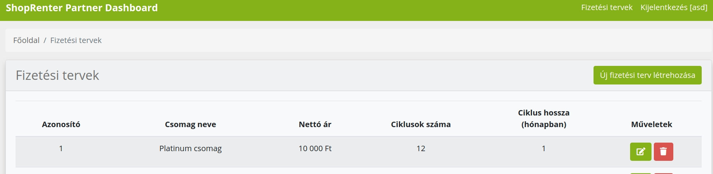
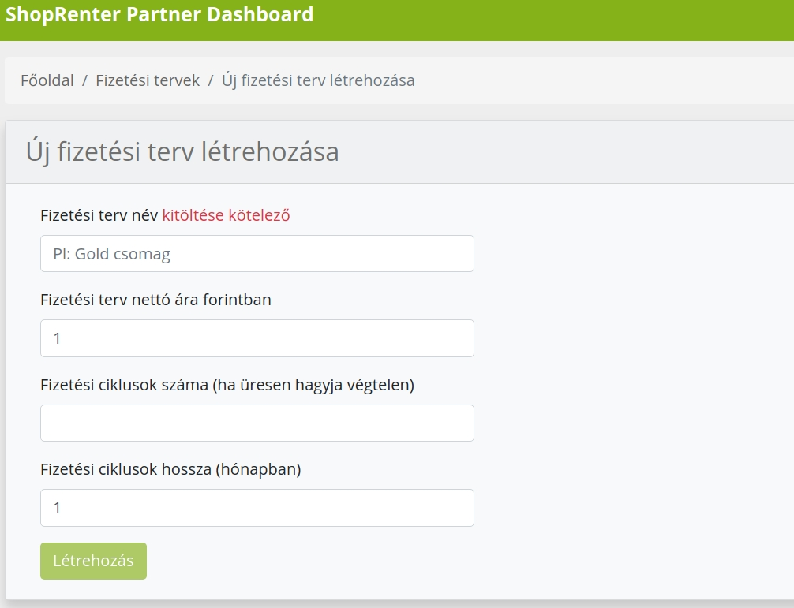

# Fizetési terv az ismétlődő díjfizetéshez

## Fizetési tervek kezelése

A fizetési terveinket a https://billing.shoprenter/plans oldalon tudjuk szerkeszteni.
Bejelentkezés után listaszerűen láthatjuk a meglévő terveinket, illetve újat adhatunk hozzá.

Fizetési terv lista oldal:

Fizetési terv létrehozása:

Megjegyzés: A lista oldalon, az **Azonosító** oszlopban lévő értékkel tudunk hivatkozni az egyes Fizetési tervekre,
amikor Ismétlődő díjfizetést akarunk létrehozni az API-n keresztül.
